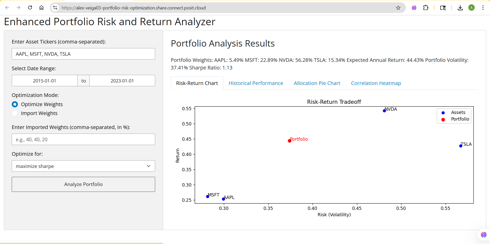

# Portfolio Risk & Return Optimization Platform

Live App: https://alex-veiga03-portfolio-risk-optimization.share.connect.posit.cloud

A deployed Python-based portfolio optimization application implementing Modern Portfolio Theory and constrained nonlinear optimization.

The platform allows users to input asset tickers, analyze historical returns, and optimize portfolio allocations by maximizing Sharpe ratio, maximizing return, or minimizing volatility.

---

## Features

- Portfolio optimization using SLSQP (SciPy)
- Sharpe ratio maximization
- Risk-return visualization
- Cumulative performance tracking
- Allocation breakdown via pie chart
- Correlation heatmap
- Custom asset and date range input
- Option to import custom portfolio weights

---

## Tech Stack

- Python
- Shiny for Python
- NumPy
- Pandas
- SciPy
- Matplotlib
- yahooquery

---

## Optimization Framework

The application computes:

- Annualized expected returns  
- Annualized covariance matrix  
- Portfolio volatility  
- Sharpe ratio (with configurable risk-free rate)  

Optimization is performed using constrained nonlinear programming (SLSQP) under full-investment constraints (weights sum to 1, no short selling).

---

## Run Locally

1. Clone the repository

2. Install dependencies:

pip install -r requirements.txt

3. Run the application:

python -m shiny run app.py

The app will launch locally at:

http://127.0.0.1:8000

---

## Repository Structure

- `app.py` — Main Shiny application
- `requirements.txt` — Project dependencies
- `README.md` — Project documentation

---

## Author

Alexander Veiga  
Finance & Business Analytics Graduate  
GitHub: https://github.com/alex-veiga03
